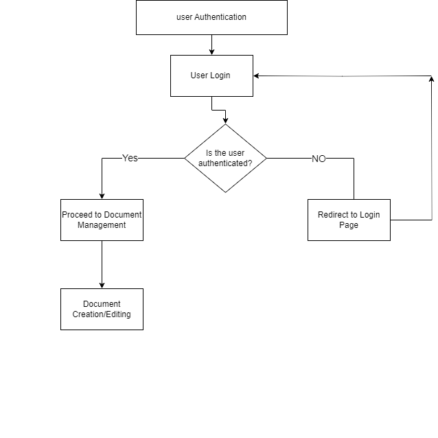
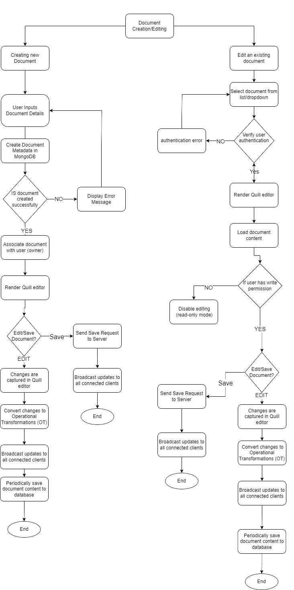

# **Collaborative Text Editor**

# Week-1 Report

## Project Overview and Requirements

The project aims to develop a web-based application enabling multiple users to collaboratively edit text documents in real-time. The application will support concurrent editing and live updates, providing users with the ability to create, edit, and share text documents seamlessly. The following components and technologies will be used:

### Frontend

- **React**: 18.3.1
- **TypeScript**: 5.4.5
- **Quill**: 1.3.7

### Backend

- **.NET**: 8.0
- **MongoDB**: 7.0.5
- **RabbitMQ**: 3.13.2

### Real-time Collaboration

- **Operational Transformations (OT)**

### Deployment

- **Docker**
- **GitHub Actions**

## Deep Analysis and Understanding

### Project Requirements

- Develop a collaborative text editor with real-time editing capabilities.
- Implement user access management with permissions.
- Ensure seamless data exchange between frontend and backend.
- Use containerization for deployment.

### Frontend

- Setup basic editor functionalities: create, edit, and share documents.
- Integrated Quill for rich text editing.
- Implemented real-time updates using Operational Transformations (OT) and Socket.IO.
- Created user access management interface.
- Set up functionalities to assign and manage user permissions.
- Integrated Socket.IO for real-time updates.

### Backend

- Set up MongoDB to manage user data, document metadata, and operational transformations for real-time editing.
- Implemented core functionalities for document collaboration and access control.
- Developed APIs for user authentication, document management, and real-time communication.
- Integrated Socket.IO for server-client communication.
- Implemented server-side logic for Operational Transformations to handle concurrent editing.

### Deployment

#### Docker

- Containerized frontend, backend, and Socket.IO server components.

#### CI/CD with GitHub Actions

- Set up automated build, test, and deployment processes.

## Learning and Exploration

- [Quill Documentation](https://quilljs.com/docs/why-quill)
- [Socket.IO Documentation](https://socket.io/docs/v4/tutorial/introduction)
- [Operational Transformations (OT) Article](https://medium.com/coinmonks/operational-transformations-as-an-algorithm-for-automatic-conflict-resolution-3bf8920ea447)
- [JWT Introduction](https://jwt.io/introduction)

# Week-2 Report

### Flow Charts

#### Flow-chart for User Authentication

#### Flow-chart for Real-time Collaboration

### Detailed Solution Algorithm

#### Authentication and Authorization:

1. User enters login credentials (e.g., username, password) on the login page.
2. Frontend sends an authentication request to the backend API with the provided credentials.
3. Backend validates credentials and generates a JSON Web Token (JWT) with user information and claims.
4. JWT is sent back to the frontend and stored.
5. Backend verifies JWT signature, validates claims (expiration, issuer, audience), and extracts user information.
6. Based on user claims, backend determines appropriate access level (read, write) for the requested resource.
7. If authorized, backend processes the request; otherwise, returns an error response (401 Unauthorized).

#### Real-time Collaboration:

1. Frontend initializes the Quill editor and attaches event listeners for text changes.
2. Frontend establishes a WebSocket connection with the backend server using Socket.IO.
3. When the user starts editing the document, the Quill editor captures the changes (e.g., text insertions, deletions, formatting).
4. Frontend converts the changes into Operational Transformations (OT) for conflict resolution.
5. Frontend sends the OT operations to the backend server via the WebSocket connection.
6. Backend receives the OT operations and broadcasts them to all connected clients (including the sender) via the WebSocket connection.
7. Connected clients receive the broadcasted OT operations from the backend.
8. Clients apply the received OT operations to their local instances of the Quill editor, reflecting the changes made by other users in real-time.
9. Clients periodically save the document content to the backend (e.g., every few seconds or after a certain number of operations) to persist the changes.
10. Backend updates the document content in MongoDB based on the received updates from clients.

### Timeline:

- **Week 1**: Submit deep analysis, understanding, research, and questions about the project and its outcomes.
- **Week 2**: Submit a detailed flow chart containing all possible if and else conditions, a detailed solution algorithm, and a timeline.
- **Week 3**: Initialize the project. Set up the basic frontend using React and TypeScript with dummy APIs. Research on Collaborative Text Editing and RabbitMQ/WebSocket/socket.io.
- **Week 4**: Develop the backend APIs using .NET 8.0 for user authentication, document management, and real-time communication (Socket.IO integration). Integrate MongoDB for storing user data, document metadata.
- **Week 5**: Merge the frontend and backend components. Implement Operational Transformations (OT) logic for real-time collaboration and conflict resolution. Integrate Socket.IO for real-time updates and collaboration.
- **Week 6**: Conduct thorough testing of the application end-to-end, fix any remaining bugs, and optimize performance.
- **Week 7**: Set up Docker containers for the frontend, backend, and Socket.IO server components. Configure GitHub Actions for CI/CD (Continuous Integration and Continuous Deployment). Deploy the containerized application to a private GitHub registry using the configured GitHub Actions pipeline.
